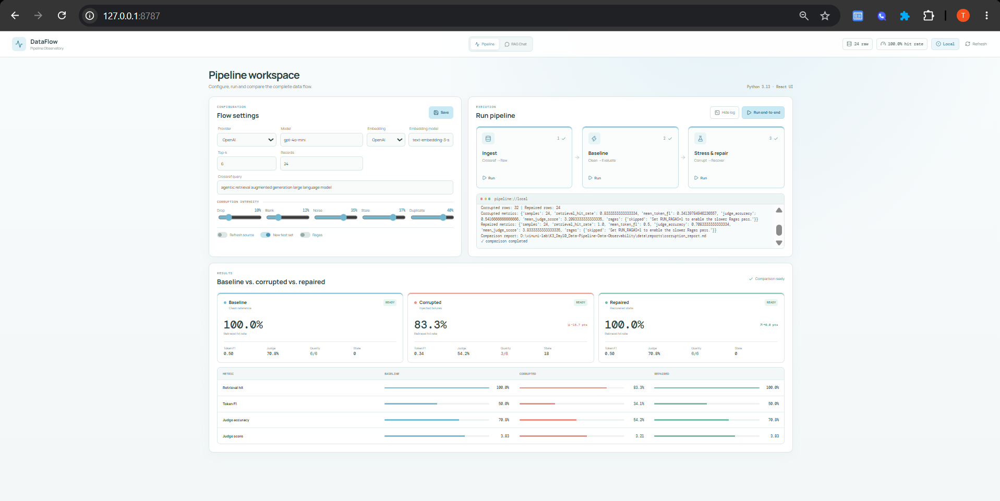
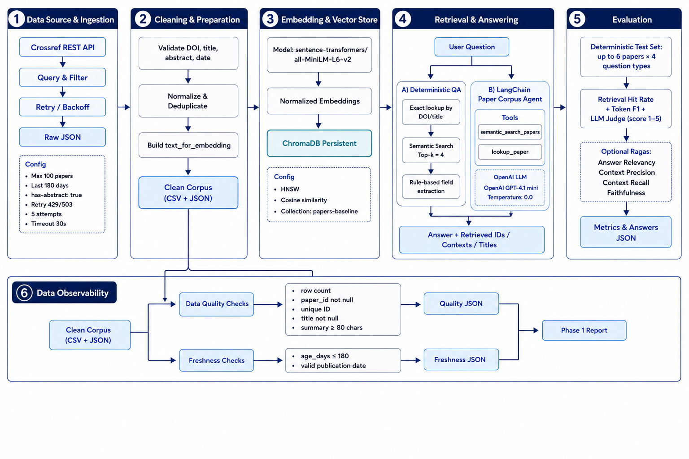

# Day 10 - Data Pipeline & Data Observability

## Local observability demo (React + TypeScript)

The demo runs the existing Python scripts, edits safe flow settings in `.env`, and compares
baseline, corrupted, and repaired artifacts.

```powershell
cd frontend
npm install
npm run build
cd ..
.\.venv\Scripts\python.exe demo\server.py
```

Open `http://127.0.0.1:8787`. For frontend development, keep the Python server running and use
`npm run dev` from `frontend/`, then open `http://127.0.0.1:5173`.

### Demo preview



### Architecture overview




