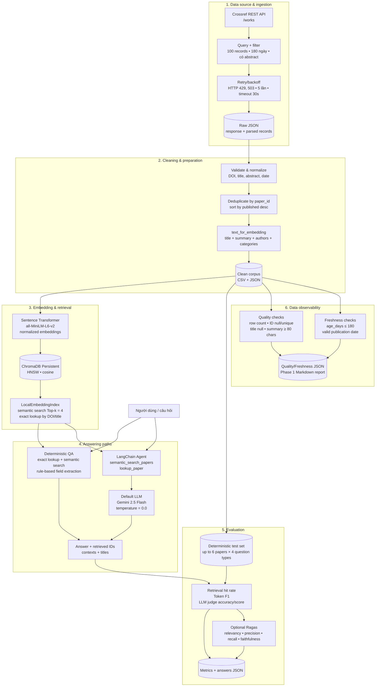

# Kiến trúc tổng thể — Data Pipeline & Data Observability cho RAG

## 1. Kiến trúc bám sát source code hiện tại

## 2. Workflow thực thi `phase1.py`

1. Đọc lại snapshot raw hoặc crawl Crossref khi `REFRESH_SOURCE=true`/chưa có dữ liệu.
2. Làm sạch, chuẩn hóa và lưu `papers_clean.csv`, `papers_clean.json`.
3. Tạo embedding, rebuild collection `papers-baseline` trong ChromaDB và lưu manifest.
4. Đọc hoặc tạo test set khi `REFRESH_TEST_SET=true`/chưa có test set.
5. Chạy baseline QA và evaluation.
6. Chạy data-quality checks và freshness report.
7. Sinh báo cáo tổng hợp Phase 1.
8. Chạy agent demo cho 3 câu hỏi đầu tiên và lưu kết quả.

## 3. Model và cấu hình chính

| Thành phần | Cấu hình trong source |
| --- | --- |
| LLM provider mặc định | `gemini` |
| LLM mặc định | `gemini-2.5-flash` |
| LLM temperature | `0.0` cho agent, LLM judge và Ragas |
| Provider hỗ trợ | Gemini, OpenAI, Anthropic, OpenRouter, Ollama, custom OpenAI-compatible |
| Embedding model | `sentence-transformers/all-MiniLM-L6-v2` |
| Chuẩn hóa vector | `normalize_embeddings=True` |
| Vector database | ChromaDB Persistent Client |
| Index | HNSW, khoảng cách cosine |
| Retrieval | Semantic search và exact lookup theo `paper_id`/title |
| Top-k mặc định | `4` |
| Collection baseline | `papers-baseline` |
| Collection corrupted | `papers-corrupted` |
| Collection repaired | `papers-repaired` |
| Crossref query | `agentic retrieval augmented generation large language model` |
| Crossref filter | Từ 180 ngày gần nhất, `has-abstract:true` |
| Số record tối đa | `100` |
| Retry Crossref | Tối đa 5 lần, exponential backoff từ 1 giây; retry 429/503 |
| HTTP timeout | 30 giây |
| Freshness threshold | `180` ngày |
| Ragas | Tắt mặc định; bật bằng `RUN_RAGAS=1` |

## 4. Luồng baseline và agent

- `evaluate_pipeline()` không dùng agent để sinh câu trả lời. Nó gọi `answer_question()`: exact title lookup nếu câu hỏi chứa title trong dấu nháy, kết hợp semantic retrieval, rồi trích xuất summary/author/date/category bằng rule.
- Agent chỉ được chạy ở bước demo cuối Phase 1. Agent bắt buộc dùng hai tools để tra cứu corpus và dùng LLM để tổng hợp câu trả lời.
- LLM judge dùng structured output với thang điểm 1–5. Nếu LLM lỗi, hệ thống fallback sang heuristic dựa trên Token F1.

## 5. Observability và artifacts

Data quality gồm 6 checks: corpus không rỗng, `paper_id` không null, `paper_id` duy nhất, title không null, summary tối thiểu 80 ký tự và `age_days` không vượt 180 ngày. Freshness report theo dõi ngày mới nhất/cũ nhất, số dòng stale, số ngày không hợp lệ và trạng thái `is_fresh`.

Artifacts được tách theo các lớp `data/raw`, `data/clean`, `data/embeddings`, `data/chroma`, `data/eval`, `data/results`, `data/quality`, và `data/reports`.

## 6. Phần chưa hoàn thiện trong source

`src/ingestion/corruption.py` và `src/pipelines/corruption_flow.py` vẫn là bài tập `TODO(student)` và đang ném `NotImplementedError`. Vì vậy nhánh dự kiến **corrupt → rebuild index → evaluate → quality/freshness → repair → rebuild → re-evaluate → compare** chưa chạy end-to-end trong source hiện tại, dù config, đường dẫn output và ba Chroma collections đã được khai báo sẵn.
